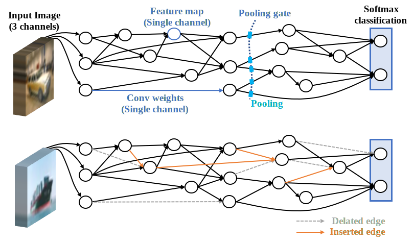

torch-evolvenet
===========================

This is implementation of architectures in the paper entitled   
**‘Exploring Huge-space Global Architecture Search via Network Evolving Based on Fine-grained Convolutional Neural Network Modeling’**

Environment
------
**Hardware**: 1 GPU (the memory should exceed 8G)  
**Packages**: Python 3.6; Pytorch 0.4.1

Steps to run
------
**Prepare the Dataset**: Put the batch files in the certain path torch-evolvenet/lib/ CIFAR10_dataset/   
**Run any pleasant python script provided.**

Explanations
------

### There are two key points implemented by the codes

1. Generate fine-grained Convolutional Neural Networks (fgCNNs) with Directed Acyclic Graphs (DAGs)
2. Train the evolving fgCNNs which have dynamic architecture

Following figure shows the overview of the architecture.

### Four scripts are provided

| File name | Function |
| ---------- | ----------- |
| train_fgCNN_rand.py | Train and test a CNN which is generated by a random DAG. Topology of the DAG is fixed. |
| train_EvolveNet.py | Train and test the CNN from a randomly generated DAG. Topology of the DAG is dynamic. It changes with the training. |
| train_fgCNN_searched.py | Train and test a CNN which is generated by a searched DAG. |
| test_fgCNN_searched.py | Test the best model obtained in experiments of the noted paper on CIFAR-10 benchmark. |

### Interesting findings: the growing connections

Following figure shows the visualized dynamic topology of the DAG in two generations (correspond to run 1 of experiments in the paper)

**As a nascent project, we are eager for interchanges and comments.**  
**Watch this branch for more information about future possible progress!**